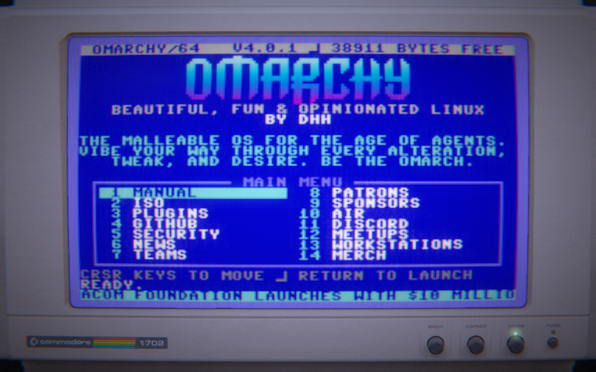

# Omarchy C64

Omarchy's website reimagined as a Commodore 64, inside a Commodore 1702 monitor.
A WebGL scene renders the monitor and CRT while a 40-column BASIC-style
interface presents the menu, documents and typed commands.

**[Visit the live site](https://omarchy.thehuman.sh)** ·
[Source on GitHub](https://github.com/thehumanworks/omarchy-c64)



The site uses plain HTML, CSS and ES modules. The build inlines JavaScript,
styles and assets into one `dist/index.html`, which also works from `file://`.
There is no framework or application server. Page copy lives in `content/`;
configured upstream sources refresh the page snapshots through the sync tools.

Physical keyboards support typed commands. On touch devices, a rocker and
Enter button on the monitor's bezel handle navigation and scrolling. Commands
and feedback stay on the CRT, with no mobile keyboard or floating badges.

## Develop

From a clone of this repository, with [mise](https://mise.jdx.dev) available:

```sh
mise install
mise run setup
npm run dev
```

Setup installs the toolchain's npm dependencies, Chromium and git hooks. The
development server rebuilds on changes and serves the page on port 8000.

```sh
npm run build   # produce dist/index.html
npm run check   # lint, format, unit/build tests, bundle and browser tests
```

See [Development](docs/DEVELOPMENT.md) for command details, applicable checks,
hooks and the proof standard. A successful dev-server start is not test proof.

## Contribute and navigate

- [Contributing](CONTRIBUTING.md): workflow for humans and AI agents, code
  quality, testing and changes that need source or visual evidence.
- [Agent instructions](AGENTS.md): repository rules and common change recipes.
- [Architecture](docs/ARCHITECTURE.md): layers, module map and the single-file
  build; read before changing `src/`.
- [Content](docs/CONTENT.md) and [Content sources](docs/CONTENT-SOURCES.md):
  editorial data, sync commands and upstream evidence. Diagnose synced copy
  before hand-editing snapshots.
- [Mobile controls](docs/MOBILE-CONTROLS.md): bezel artwork, projection and
  interaction verification.
- [Deployment](docs/DEPLOYMENT.md): Cloudflare Pages, previews, production,
  secrets and rollback. The Cloudflare project remains `omarchy-website`.

## Licensing

[`package.json`](package.json) marks this project `UNLICENSED`; this repository
does not include a project license grant. Vendored three.js carries its own MIT
license header; see [vendor/README.md](vendor/README.md) for its version and
upgrade process. Upstream content has separate attribution and licensing
considerations documented in [Content sources](docs/CONTENT-SOURCES.md).
